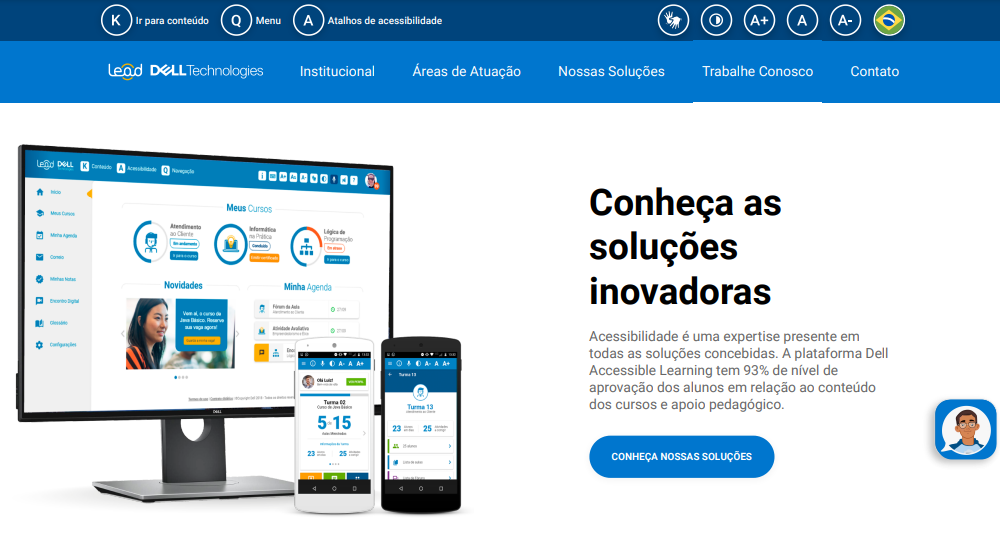
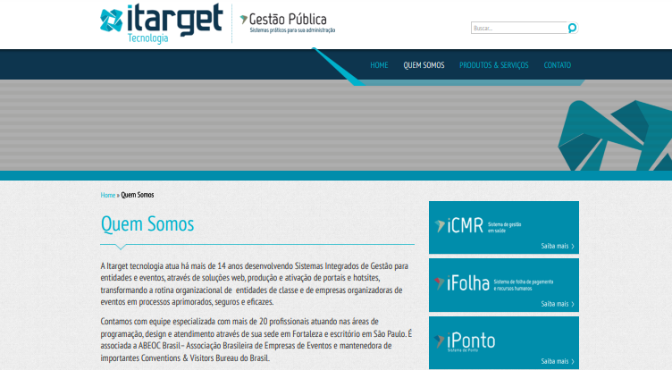

   

## About me

👋 Hi there! I'm Vitoria Moreira, a passionate coder from Brazil. 🇧🇷

💻 Software Engineer | 🌐 Currently crafting my portfolio

🎓 Holding a technical degree and a bachelor's

⌛ 8 years on the programming journey | 💼 Over 3 years in the job market 🚀

## Expertise in

#### FRONTEND

  

#### BACKEND

  

#### DEVOPS

  

## Projects

#### LEAD DELL

###### Dell Technologies Projects Showcase 🚀

As a leader in one of Dell Technologies' diverse frontend teams, I've spearheaded the development of internal projects. 💻

🔗 Come take a look: [Lead Dell](https://github.com/vivi-more/vivi-more/tree/main/projects/leaddell/README.md)

 

#### DTAX BRASIL

###### Dtax Brasil Projects Showcase 💼📊

In Dtax Brasil's dynamic team, I've contributed with the project in Web, Mobile, and Cloud for including tax declaration solutions. 🌐💻📊

🔗 Come take a look: [Dtax Brasil ](https://github.com/vivi-more/vivi-more/tree/main/projects/dtax/README.md)

 

#### WE CARE.FITNESS

###### We Care.Fitness Projects Showcase 💪🏋️‍♂️

In the dynamic team at We Care.Fitness, I've contributed to projects in Web, Mobile, and Cloud, with a focus on digital fitness solutions. 🌐💻📈

🔗 Come take a look: [We Care.Fitness](https://github.com/vivi-more/vivi-more/tree/main/projects/wecarefitness/README.md)

 

#### ITARGET TECNOLOGIA

###### Itarget Tecnologia Projects Showcase 🎯💻

During my internship at Itarget Tecnologia, I learned a great deal while working on projects specializing in HR solutions. 🌐👩‍💼

🔗 Come take a look: [Itarget Tecnologia](https://github.com/vivi-more/vivi-more/tree/main/projects/itargettecnologia/README.md)
