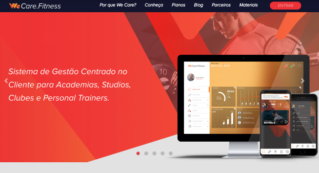

   

## About me

👋 Hi there! I'm Vitoria Moreira, a passionate coder from Brazil. 🇧🇷

💻 Software Engineer | 🌐 Currently crafting my portfolio

🎓 Holding a technical degree and a bachelor's 

⌛ 8 years on the programming journey | 💼 Over 3 years in the job market 🚀

## Expertise in

#### FRONTEND

  

#### BACKEND

  

#### DEVOPS

  

## Projects

#### LEAD DELL

###### Dell Technologies Projects Showcase 🚀

As a leader in one of Dell Technologies' diverse frontend teams, I've spearheaded the development of internal projects.  💻

🔗 Come take a look: [Dell](seu_link_aqui)

 

#### DTAX BRASIL

###### Dtax Brasil Projects Showcase 💼📊

In Dtax Brasil's dynamic team, I've contributed with the project in Web, Mobile, and Cloud for including tax declaration solutions. 🌐💻📊

🔗 Explore our work: [Dtax Brasil ](your-link-here)

 

#### WE CARE.FITNESS

###### We Care.Fitness Projects Showcase 💪🏋️‍♂️

In the dynamic team at We Care.Fitness, I've contributed to projects in Web, Mobile, and Cloud, with a focus on digital fitness solutions. 🌐💻📈

🔗 Explore our work: [We Care.Fitness](your-link-here)

